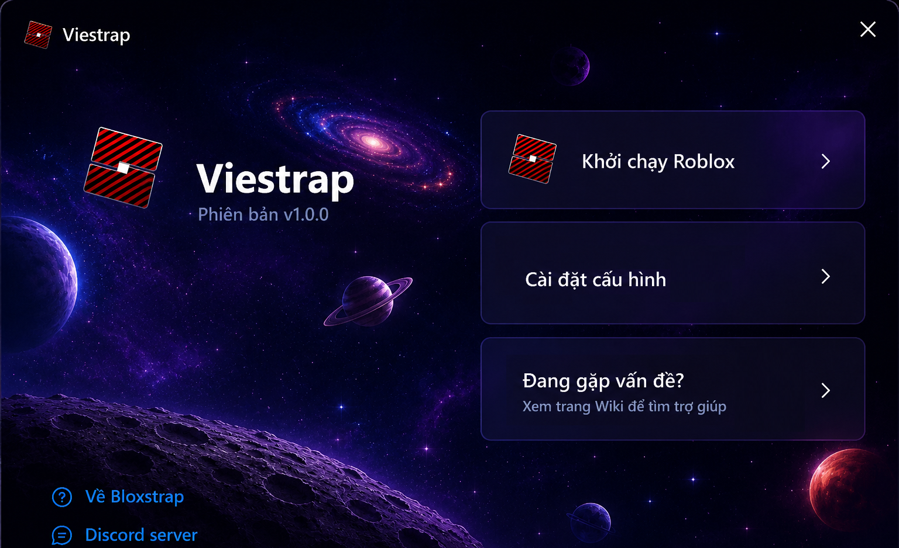
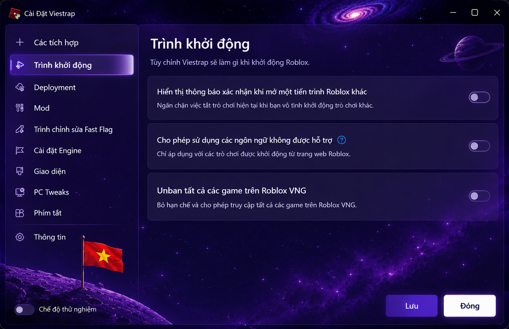
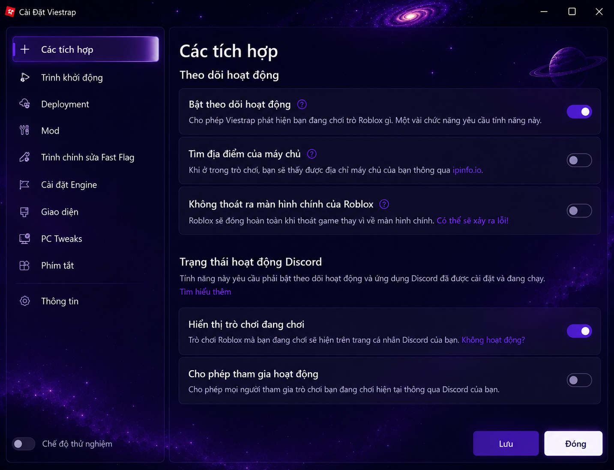

<div align="center">

# Viestrap

**Trình khởi động Roblox thay thế, mang đến nhiều tính năng mở rộng, khả năng tùy chỉnh cao và trải nghiệm Roblox Quốc tế ổn định hơn.**

<br>

<a href="https://github.com/Viestrap-official/Viestrap/releases/tag/v1.0.2">
  
</a>

<a href="https://github.com/Viestrap-official/Viestrap/releases/tag/v1.0.2-fix-v1%2Bv2">
  
</a>

<a href="https://discord.gg/dwWsupz7v">
  
</a>

<br><br>



</div>

---
# LƯU Ý !!!

- Ai bật lên mà bị shutdown thì đừng lo, đó là 1 lỗi không nghiêm trọng đâu, nếu bị vậy thì ae đọc kỹ hướng dẫn tải và cách dùng của file fix nhé, cần thì có thể vô sv discord và inbox tài khoản discord của tôi, chúc ae sử dụng tốt !!!
# 🔧 Cập nhật Viestrap V1.0.2 — Sửa lỗi & Cải tiến

## 📅 Cập nhật: 22/07/2026

### 🛠️ Thay đổi

- Thêm **FFlag Injector**
- Khắc phục lỗi ứng dụng tự khởi động lại khi mở
- Cải thiện độ ổn định của Launcher
- Thêm **File Fix (V1 + V2)** dành cho người dùng gặp lỗi khởi động

---

# 📥 Hướng dẫn File Fix

Nếu Viestrap không hoạt động đúng hoặc gặp lỗi khi khởi động:

> **ƯU TIÊN SỬ DỤNG V2 TRƯỚC, SAU ĐÓ MỚI ĐẾN V1.**

1. Tải và cài đặt **Viestrap** trước.
2. Tải **File Fix (V1 + V2)**.
3. Chạy File Fix.
4. Sau khi chạy xong hãy **đợi máy tính tự Shutdown**. Nếu sau tối đa **20 giây** máy vẫn chưa tự tắt, hãy tự Shutdown rồi bật máy lại và thử với **V1**.
5. Nếu vẫn gặp lỗi, hãy **quay video** và gửi vào Discord để được hỗ trợ.

> **Nếu V1 không khắc phục được vấn đề, hãy chuyển sang sử dụng V2.**

---

# 🚀 Cập nhật quan trọng (19/07/2026)

> [!IMPORTANT]
> **Hỗ trợ Roblox Quốc tế**
>
> Viestrap tích hợp giải pháp tối ưu giúp người dùng Việt Nam kết nối tới Roblox Quốc tế ổn định hơn, hạn chế các vấn đề kết nối và những ảnh hưởng do thay đổi khu vực.
>
> Sau khi Roblox hợp tác với **Roblox VNG**, nhiều người chơi Việt Nam gặp phải các vấn đề như không thể truy cập một số trò chơi quốc tế, khó tham gia cùng bạn bè, một số trò chơi không hiển thị hoặc yêu cầu sử dụng VPN/WARP để truy cập. Viestrap được phát triển nhằm mang đến trải nghiệm Roblox Quốc tế thuận tiện hơn, giúp việc kết nối ổn định, dễ dàng và nhanh chóng hơn mà không cần thực hiện nhiều thao tác thủ công.
>
> Đồng thời, Viestrap còn hỗ trợ người chơi theo dõi vị trí máy chủ để lựa chọn VPN hoặc Cloudflare WARP có điểm kết nối phù hợp, góp phần tối ưu đường truyền khi tham gia các máy chủ quốc tế.
>
> Trải nghiệm mượt mà hơn trên các tựa game như:
>
> - Blox Fruits
> - 99 Nights
> - GAG 2
> - ...
> - Và hàng nghìn trò chơi Roblox khác.

<div align="center">

</div>

---

# 📥 Cài đặt

1. Truy cập **GitHub Releases** và tải phiên bản **Viestrap** mới nhất.
2. Chạy **Viestrap.exe**.
3. Nếu **Windows Defender** hoặc phần mềm diệt virus hiển thị cảnh báo (**False Positive**), hãy đảm bảo bạn đã tải từ **GitHub Releases chính thức**. Có thể tạm thời tắt **Windows Security Real-time Protection** hoặc thêm Viestrap vào danh sách ngoại lệ trước khi khởi động ứng dụng.( tốt nhất là tắt ngay từ lúc tải, sau khi vô được roblox bật lại vẫn chưa muộn )
4. Nếu gặp lỗi khi mở ứng dụng, hãy tải **File Fix (V1 + V2)** và làm theo hướng dẫn ở phía trên.
5. Khởi động Roblox thông qua **Viestrap** và tận hưởng trải nghiệm.

---

# ✨ Tính năng

<table>
<tr>

<td width="50%" valign="top">

## 🎨 Giao diện hiện đại

Được xây dựng bằng **WPF UI**, mang đến giao diện hiện đại, trực quan và đẹp mắt theo phong cách Windows 11. Thiết kế được tối ưu để mọi tính năng đều dễ dàng tìm kiếm và sử dụng, giúp cả người dùng mới lẫn người dùng lâu năm đều có thể thao tác nhanh chóng.

## ⚙️ Tùy chỉnh linh hoạt

Tùy chỉnh giao diện, màu sắc, chủ đề (Theme) và nhiều thiết lập khác của trình khởi động. Người dùng có thể dễ dàng bật hoặc tắt các tính năng, lưu cấu hình yêu thích và quản lý mọi thiết lập ngay trong giao diện mà không cần chỉnh sửa các tệp cấu hình thủ công.

## 🌎 Thông tin máy chủ

Hiển thị **khu vực máy chủ, Ping và thời gian hoạt động (Uptime)** thông qua **RoValra API**. Nhờ đó người dùng có thể xác định chính xác vị trí máy chủ Roblox đang tham gia để lựa chọn **VPN hoặc Cloudflare WARP** có điểm kết nối gần trung tâm dữ liệu nhất, góp phần tối ưu đường truyền, cải thiện độ ổn định kết nối và mang lại trải nghiệm tốt hơn khi chơi trên các máy chủ quốc tế.

## ⚡ Hiệu năng

Tối ưu quá trình khởi động Roblox giúp thời gian mở game nhanh hơn, giảm các thao tác không cần thiết trong quá trình khởi chạy và mang lại trải nghiệm ổn định hơn sau mỗi lần Roblox cập nhật.

## 🔧 FFlag Injector

Tích hợp **FFlag Injector** với khả năng cấu hình chỉ bằng **một cú nhấp chuột**, không cần chỉnh sửa thủ công các tệp cấu hình Roblox. Bộ FFlag được tối ưu nhằm cải thiện hiệu năng, tăng FPS trong nhiều trường hợp, giảm hiện tượng giật (Stutter), tối ưu tốc độ tải tài nguyên và mang lại trải nghiệm chơi game mượt mà hơn. Các cấu hình được lựa chọn dựa trên quá trình thử nghiệm thực tế và ưu tiên tính ổn định để người dùng có thể sử dụng nhanh chóng mà không cần tự tìm hiểu hàng trăm FFlag khác nhau.

</td>

<td width="50%" valign="middle">



</td>

</tr>
</table>

---

# 🛠️ Cài đặt nhanh

Mở **Windows Terminal** và chạy:

```bash
winget install viestrap
```

---

# 💬 Cộng đồng

Tham gia máy chủ Discord để nhận hỗ trợ, báo lỗi và cập nhật thông báo mới nhất.

**Discord:** https://discord.gg/dwWsupz7v

---

# 📌 Lưu ý

- Viestrap là dự án do cộng đồng phát triển và **không liên kết với Roblox Corporation**.
- Luôn tải Viestrap từ **GitHub Repository chính thức** để đảm bảo an toàn và nhận được các bản cập nhật mới nhất.
- Sau mỗi bản cập nhật của Roblox, hãy kiểm tra mục **Releases** để tải phiên bản tương thích mới nhất.
- Nếu gặp bất kỳ lỗi nào, hãy quay video hoặc chụp ảnh màn hình và gửi vào Discord để đội ngũ phát triển hỗ trợ nhanh nhất.

---

<div align="center">

Made with ❤️ by the Vietnamese Roblox Community

</div>
